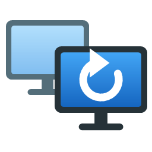
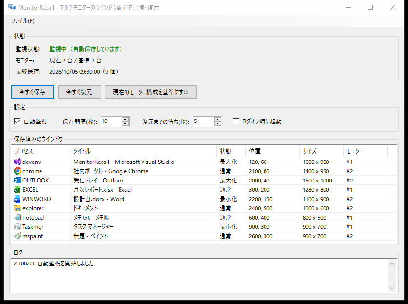

<p align="center">
  
</p>

<h1 align="center">MonitorRecall</h1>

<p align="center">マルチモニターのウインドウ配置を記憶し、モニター復帰時に自動で元に戻す Windows 常駐ツール</p>

---

## こんな問題を解決します

マルチモニター環境でモニターの電源を切ったりスリープさせたりすると、Windows がすべてのウインドウを 1 台のモニターに集めてしまいます。電源を入れ直してもウインドウは戻らず、毎回手作業で並べ直すことになります。

MonitorRecall は全モニターがそろっている間の配置を自動で記録しておき、モニター構成が元に戻ったタイミングで各ウインドウを元のモニター・位置・サイズへ復元します。



## 主な機能

- **自動保存**: 全モニターがそろっている（基準構成の）間だけ、一定間隔でウインドウ配置を保存
- **集約後の配置で上書きしない**: モニター台数が減ると保存を自動停止
- **自動復元**: 基準構成に戻ったことを検知し、数秒待ってから復元
- **状態の再現**: 最大化・最小化・通常表示を保存時の状態で復元（最大化から最小化したウインドウは、元に戻すと最大化で開く）
- **タスクバーボタンも移動**: 最小化中のウインドウも、タスクバーボタンが元のモニター側へ移る
- **フォーカスを奪わない**: 復元中に作業中のウインドウがアクティブ化されない
- **タスクトレイ常駐**: × ボタンでトレイに格納。ダブルクリックで画面を表示
- **ログオン時の自動起動**: 画面のチェックボックスで切り替え
- **コマンドライン操作**: `save` / `restore` でスクリプトやタスクスケジューラーから利用可能

## 動作環境

- Windows 10 / 11
- .NET 10 デスクトップランタイム（ビルドには .NET 10 SDK）

## 使い方

1. **すべてのモニターを接続・点灯した状態で** `MonitorRecall.exe` を起動します。起動時のモニター構成が「基準構成」になります。
2. 「ログオン時に起動」にチェックを入れておくと、次回からはサインイン時にタスクトレイで自動起動します。
3. あとはモニターの電源を切ったり入れたりしても、復帰時に自動で配置が戻ります。

| 画面の項目 | 説明 |
|---|---|
| 今すぐ保存 | 現在の配置を即時保存 |
| 今すぐ復元 | 保存済みの配置を即時復元 |
| 現在のモニター構成を基準にする | モニターを増設・交換したときなどに、基準構成を更新 |
| ファイル → エクスポート... | 設定と保存済みのウインドウ配置を JSON ファイルに書き出す |
| ファイル → インポート... | エクスポートしたファイルから設定を読み込む。配置が含まれていれば、その場で復元するか選択できる |
| ファイル → 終了 | アプリを終了（× ボタンはタスクトレイへ格納） |
| 自動監視 | 自動保存・自動復元のオン / オフ |
| 保存間隔(秒) | 自動保存の間隔（既定 10 秒） |
| 復元までの待ち(秒) | モニター復帰を検知してから復元するまでの待ち時間（既定 5 秒） |
| ログオン時に起動 | サインイン時にタスクトレイで自動起動 |

> **Tip:** モニターによっては復帰直後に解像度の認識が安定しないことがあります。復元がうまくいかない場合は「復元までの待ち」を 10 秒程度に延ばしてください。

### コマンドライン

```bash
MonitorRecall.exe                  # 画面を表示して常駐
MonitorRecall.exe --minimized      # タスクトレイのみで常駐
MonitorRecall.exe save             # 現在の配置を保存して終了
MonitorRecall.exe restore          # 保存済みの配置を復元して終了```

常駐中にもう一度起動すると、起動中の画面が前面に表示されます。

## Windows 側のおすすめ設定

タスクバーボタンを各モニターに表示したい場合は、**設定 → 個人用設定 → タスクバー → 複数のディスプレイ** で次のように設定してください。

- タスクバーをすべてのディスプレイに表示する: **オン**
- タスクバー ボタンの表示先: **ウインドウが開いているタスクバー**

## 保存データ

| ファイル | 内容 |
|---|---|
| `%APPDATA%\MonitorRecall\layout.json` | ウインドウ配置（プロセス名・タイトル・位置・サイズ・表示状態など） |
| `%APPDATA%\MonitorRecall\settings.json` | 画面の設定値 |

ログオン時の自動起動は `HKCU\Software\Microsoft\Windows\CurrentVersion\Run` の `MonitorRecall` に登録されます。

## 制限事項

- 管理者権限で動作しているウインドウは、MonitorRecall も管理者として実行しないと移動できません。
- ウインドウはプロセス名・クラス名・タイトルで照合するため、同じアプリの同名ウインドウが複数ある場合は入れ替わることがあります。
- ストアアプリ（設定・電卓など）は一覧上で共通のアイコンが表示されます。
- 最小化されていたウインドウは、タスクバーボタンを移すため復元時に一瞬表示されます。
